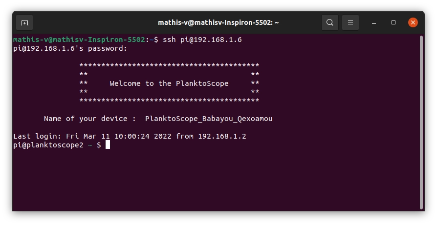
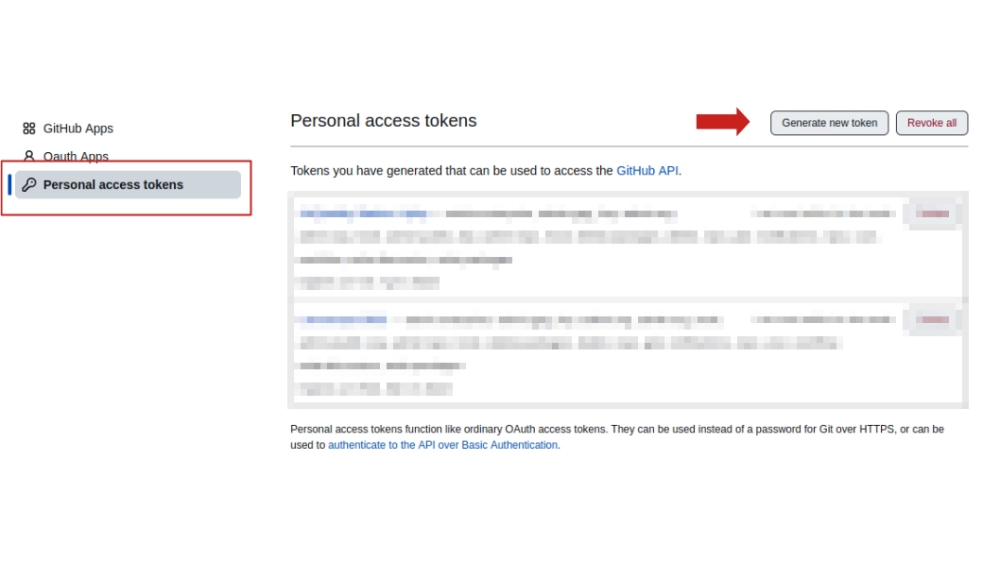
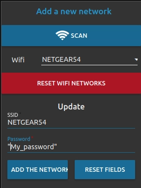

# How to make your own development environment

## Start coding

1. Remote connexion to the PlanktoScope

In order to acces to all the files of your raspberry pi and do more advanced modification to the Node-Red interface, you must log into the raspberry-pi by SSH protocol.

To log in, on Windows or Ubuntu, you must open a terminal (cmd for windows), and enter the following line : 

```
ssh 'user'@'ip of planktoscope'
```

Replacer 'user' by the current user on your raspberry pi (Usually **pi**).

For 'ip of planktoscope' there are 2 possibilities :

1. Your computer is connected to the PlanktoScope's wifi. 
It's to simple, the ip is always the same **192.168.4.1**. If you are not sure, you can find it by going to Node-Red interface -> page `Wifi` -> section `Current Connection` in the ip line.


The code line to connect is now : 
``` 
ssh pi@192.168.4.1
```

2. Your PlanktoScope is connected to the network wifi. For that you must connect your computer to the same wifi and scan this network to find PlanktoScope ip's.

To do a scan, we advise you to download the software [Angry IP Scanner](https://angryip.org/download/#linux).

Once it is downloaded and installed, make a change in the display. Go to `Outils` -> `Préférences` -> `Affichage` ->section `Affiche dans la liste des résultats` -> select `Hôtes actifs`.

Now you can launch scan by cliking on **Démarrer**


At the end you get one line with name of host  "planktoscope.local". In this example my PlanktoScope is set to the ip **192.168.1.5**


Now you can connect at you raspberry pi by ssh   



!!! Note
    If you see the following error message " WARNING: REMOTE HOST IDENTIFICATION HAS CHANGED". To resolve it use this command : (change ip by your value)

    ssh-keygen -R <ip>

!!! Note 
    For more information about files in the raspberry pi, check this section [file organisation](Make_your_modification.md#file-organization).

## Set up your personal repository git

Usualy when you do software development, you use a versioning software to track the changes in any set of files. For this project we used **git** and in this section we will describe to you how to set up your personal repository.

1. Create your account on [GitHub](https://github.com/)
2. Create a repository : clik on **New** in left menu.
3. Now, in your raspberry pi, go to the folder Planktoscope (using ssh connection)
* add your personal data
```
git config --global user.name "Mathis"                     #to set your name
git config --global user.email "mathis.....@gmail.com"     #to set your email adresse
git config --global credential.helper store                #to save your password
```

* Add a link to your online repository, the link is a web adress available from your github account.
```
git remote add <name_of_remote> <link>
```
* Create and go to the new branch for you developmennt.
```
git checkout -b <name>
```

Now you are ready to start your modifications and send them to your repository.
However the first time that you push your modifications the systeme ask you a password. 
!!! Warning
    Do not enter your passwod! Here you need to create a 'Token' on github, to do it go to GitHub.

* On GitHub go to **Settings**


* On left menu click on **Developer Settings** -> then click on **Personal access tokens** -> and **Generate new token**.



* On the new page fill the informations like name, time before expiration, select all case and click on **Generate token**. Now copy your token.

!!! Warning
        You can see your token just 1 time, if you forget then you need to new generate one.

Now past your token in the password section.

To send your data use the line : 
```
git push <name_of_remote> <name_of_branch>
```

The first time the system ask you your username and password fill these section by you GitHub username and your token.

## Set up a local network to develop on several Planktocope

To be able to develop remotely on different Planktoscope with an internet connection, we have to connect each PlanktoScope to a local network with an internet connection.  


This solution allow us to make developement easier.

### Connect a PlanktoScope to the wifi

To connect your PlanktoScope to a wifi network, you must be connected to the PlanktoScope's wifi. 

* Acces to wifi setting by going to the Node red interface -> `Wifi`
* In the section `Add a new network`, select your wifi ssid in the wifi line. If the ssid not appear, click on **SCAN**.


* Next step, fill the field **"Password"** with the password of your ssid. To finish click on **"ADD THE NETWORK"**.



!!! Note
        The new configuration can take some time (Around 5 min max)
        
### Sharing an internet connection with you computer

Like the organisation network above, one computer absorbing the internet connection and difusing it to the wifi router.

This solution is very good if you don't have a wifi connection at your place or if the ips are hidden in your wifi network.


To do it :

* On ubuntu : [Tuto ubuntu](https://askubuntu.com/questions/359856/share-wireless-internet-connection-through-ethernet)
  
* On Windows : [Tuto windows](https://www.tomshardware.com/how-to/share-internet-connection-windows-ethernet-wi-fi)


## File Organization


## Code Organisation


